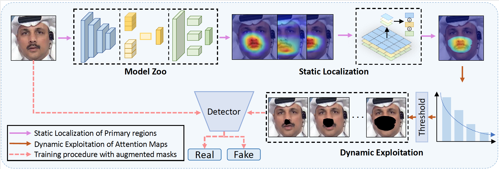

# Code for "**Towards Generalizable Deepfake Detection by Primary Region Regularization**"

## Introduction

This is the code repository for our paper "Towards Generalizable Deepfake Detection by Primary Region Regularization," which has been accepted by ACM ToMM.
Our method achieves improved generalizability of deepfake detection by searching for the 'primary region' in the face.

## Pipeline



## Quick Start

First, please update the settings in `./config/yaml/efficient.yaml`.

Get the ckpt form [Ckpt](https://drive.google.com/file/d/131TR01kyh1cmM7nMiBr4v3qWjUZ6uMDx/view?usp=drive_link),

and then run:

```
python train_effcientnet.py
```

If you want to train the model, you should first download or make your own primary region maps. The maps are fused from 
CAM maps. We have provided one sample at [fusion_heat_maps](https://drive.google.com/file/d/1PLGft4uwNpD3k4aEYJFxv_LgDxDIlzPA/view?usp=drive_link)

Then you can update the `./config/yaml/efficient.yaml` and run:

```
python train_effcientnet.py
```

## Reference

If you find our paper is useful, kindly cite it:

```
@article{Cheng_PRLE_2025,
author = {Cheng, Harry and Guo, Yangyang and Wang, Tianyi and Nie, Liqiang and Kankanhalli, Mohan},
title = {Towards Generalizable Deepfake Detection by Primary Region Regularization},
year = {2025},
publisher = {ACM},
journal = {ACM Transactions on Multimedia Computing, Communications and Applications},
}
```

